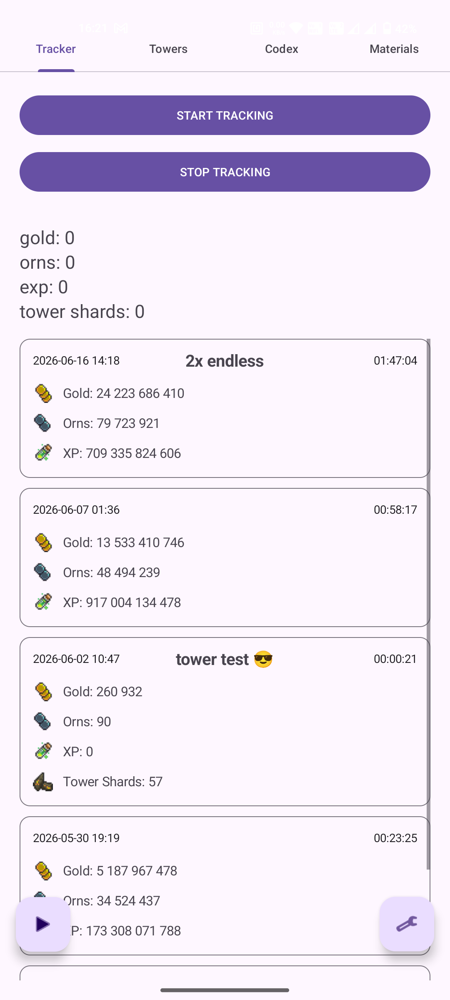
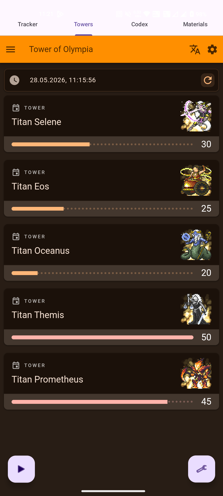
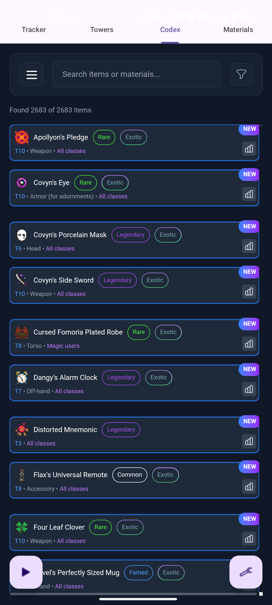
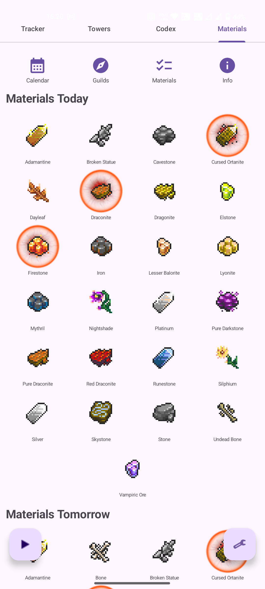
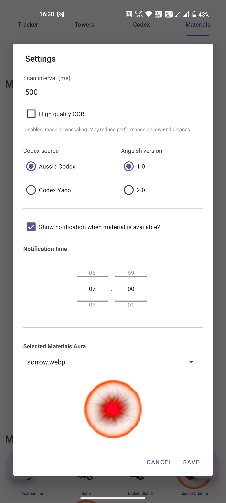
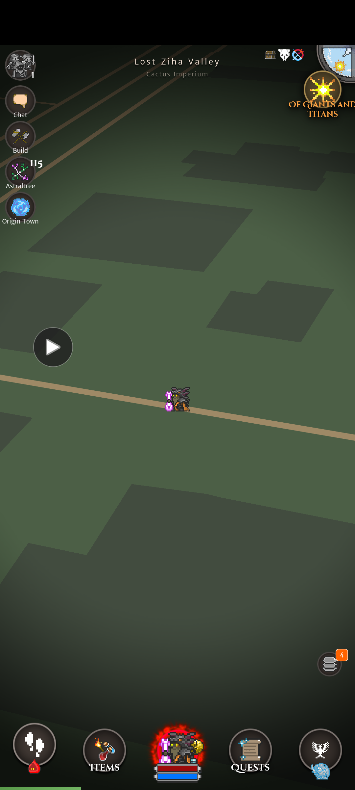

# FightTracker

FightTracker is an Android companion app for **Orna RPG** focused on:

* Live reward tracking using OCR
* Material forecast browsing
* Daily material notifications
* Tower + Codex quick access
* Session statistics tracking

The app uses Android MediaProjection + ML Kit OCR to detect rewards directly during game.

<p align="center">
  
  
  
</p>
<p align="center">
  
  
  
</p>
---

# Features

## OCR Reward Tracking

FightTracker scans the screen using Android MediaProjection and:

* Detects reward popups
* Parses:
  * Gold
  * Orns
  * Experience
  * Tower Shards
* Tracks totals across a session
* Prevents duplicate reward counting

Uses:

* Google ML Kit OCR
* Bitmap preprocessing
* Cropped screen regions for performance

---

## Floating Tracker Overlay

Includes a floating overlay tracker that can:

* Start/stop tracking quickly
* Stay visible above Orna
* Reduce the need to reopen the app

Requires:

* SYSTEM_ALERT_WINDOW permission

---

## Material Forecast System

Displays:

* Materials Today
* Materials Tomorrow
* Guild-specific material rotations
* Materials Calendar (5 next dates for each material)

Sources include:

* Remembrance
* Coral
* Anguish 1.0 / 2.0
* Sparring
* Trials
* Towers

Users can:

* Select targeted materials
* Highlight tracked materials with animated aura effects
* Receive daily notifications if selected materials are available

---

## Daily Material Notifications

Uses AlarmManager alarms to:

* Trigger once per day
* Survive device reboot
* Respect user-selected notification time

Notification system includes:

* Exact daily scheduling
* Boot persistence
* Notification channel support
* Today/Tomorrow material matching

---

## Aura System

Tracked materials display custom animated aura overlays.

Aura assets are loaded dynamically from:

```text
assets/aura/
```

Users can choose their preferred aura from settings.

---

## Codex Integration

Quick-access embedded web views for:

* Aussie Codex
* YACO Codex
* Tower shedule

---

# Tech Stack

## Android

* Kotlin
* Android SDK
* Foreground Services
* MediaProjection API
* AlarmManager
* WorkManager (legacy support)

## OCR

* Google ML Kit Text Recognition

## UI

* Fragments
* ViewPager2
* Material Components
* Coil image loading

---

# Permissions

The app uses the following permissions:

```xml
<uses-permission android:name="android.permission.FOREGROUND_SERVICE" />
<uses-permission android:name="android.permission.POST_NOTIFICATIONS" />
<uses-permission android:name="android.permission.SYSTEM_ALERT_WINDOW" />
<uses-permission android:name="android.permission.RECEIVE_BOOT_COMPLETED" />
<uses-permission android:name="android.permission.SCHEDULE_EXACT_ALARM" />
```

---

# Installation

## Requirements

* Android 10+
* Notification permission
* Overlay permission

## Build

Open in Android Studio and run:

```bash
./gradlew assembleDebug
```

---

# Credits

Forecast data provided by:

## Data Entry

* Cosmo
* Ethiraric
* Knight411
* Konq
* Sirith23
* Zach669
* ZaharX97

## Screenshots / Sources

* Many Individuals — Orna Legends
* 13cat1 — Jotunheim
* AussiePlz — Jotunheim
* Cher_ — Jotunheim
* costagamer — Cade Labs
* Firzen — OrnHub
* h a r m l e s s — OrnHub
* Henry the Mage — Jotunheim
* lilysparkle — Omnicracy
* LuuCuong — OrnHub
* Maxiz — Omnicracy
* minh tri huynh — Omnicracy
* Myrfie — His Spreadsheet
* NyaDove — OrnHub
* Obscurity — Omnicracy
* Ripl — Jotunheim
* Rivir — Omnicracy
* RubberChicken — Cade Labs
* Sirith23 — His Phone
* Smelty — Omnicracy
* Takru — Jotunheim
* Warren — Omnicracy
* zexterior — Omnicracy

Original spreadsheet:

[https://docs.google.com/spreadsheets/d/1gWTEeQnFlNePLTOLCbrzyMWljJjR01L84z2tpeaOAi8/edit?gid=1635134007#gid=1635134007](https://docs.google.com/spreadsheets/d/1gWTEeQnFlNePLTOLCbrzyMWljJjR01L84z2tpeaOAi8/edit?gid=1635134007#gid=1635134007)

---

# Disclaimer

FightTracker is a fan-made utility project and is not affiliated with Orna RPG or Northern Forge Studios.
